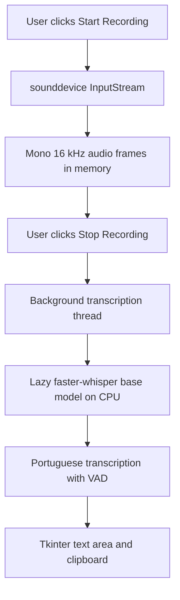

# Audio to Text

A small macOS desktop application that records microphone audio and transcribes it locally with [faster-whisper](https://github.com/SYSTRAN/faster-whisper). It is designed for short spoken notes, drafts, and conversations in Brazilian Portuguese, including technical terms in English.

## Features

- Simple Tkinter window with **Start Recording** and **Stop Recording** controls.
- Recording timer shown while audio is being captured.
- Local Portuguese transcription using Whisper through `faster-whisper`.
- Audio captured as mono, 16 kHz, 32-bit floating-point samples.
- Lazy model loading: the Whisper model is loaded when the first transcription starts, not when the window opens.
- Transcription history kept in the text area for the current app session.
- **Copy Text** button for sending the current text to the macOS clipboard.

## Architecture And Data Flow



`MicrophoneRecorder` wraps `sounddevice.InputStream` and collects copied audio frames in memory. When recording stops, `SpeechTranscriberApp` joins the frames, starts a daemon worker thread, and calls `WhisperModel.transcribe()` with Portuguese as the requested language. The worker schedules the result back onto Tkinter's main loop so the interface stays responsive.

## Prerequisites

- macOS.
- Python 3.11 or newer. The current development environment uses Python 3.12.
- A working microphone and permission for the Python application that launches the script.
- A Python installation that includes Tkinter. Check it with:

  ```bash
  python3 -m tkinter
  ```

  A small Tk window should open. If the module is missing, install Python from [python.org](https://www.python.org/downloads/macos/) and retry.

The first model download requires an internet connection. Xcode Command Line Tools may also be needed if `pip` must build a dependency locally:

```bash
xcode-select --install
```

## Installation

Clone the repository using its SSH URL:

```bash
git clone git@github.com:xfelipealves/audio-to-text.git
cd audio-to-text
```

Create and activate a virtual environment, then install the runtime dependencies:

```bash
python3 -m venv .venv
source .venv/bin/activate
python -m pip install --upgrade pip
python -m pip install faster-whisper sounddevice numpy
```

The project intentionally does not track `.venv`, Python bytecode, or downloaded model files. Keep the virtual environment activated when running the app.

## Microphone Permissions

On the first recording attempt, macOS may ask for microphone access. Allow the Python application or terminal that starts the script. If access was denied, open **System Settings > Privacy & Security > Microphone**, enable the relevant application, and restart the app.

## Model Download

The default model is `base`, loaded on the first transcription. `faster-whisper` downloads the model from its model source and caches it locally; the download is not repeated on every recording. The initial download can take time and requires network access. Subsequent runs can use the local cache unless it is removed or unavailable.

## Usage

```bash
source .venv/bin/activate
python transcriber_app.py
```

1. Click **Start Recording** and speak in Brazilian Portuguese.
2. Use English technical terms when needed; the app's prompt asks the model to preserve them.
3. Click **Stop Recording**. The app transcribes the captured audio in the background and appends the result to the text area.
4. Click **Copy Text** to copy the text currently visible in the text area.

The window can remain open for multiple recordings. The loaded model is reused during that process.

## Model Tuning

The model and CPU settings are defined in `_get_model()` in `transcriber_app.py`:

```python
self.model = WhisperModel(
    "base",
    device="cpu",
    compute_type="int8",
)
```

To trade speed and memory for accuracy, replace `"base"` with a supported model such as `"small"`, `"medium"`, or `"large-v2"`. Larger models generally improve recognition but take longer and require more memory. Keep `device="cpu"` and `compute_type="int8"` for the current CPU-oriented setup unless you are intentionally changing the runtime configuration.

The transcription call also uses `beam_size=5`, `language="pt"`, `task="transcribe"`, `temperature=0.0`, `condition_on_previous_text=False`, and `vad_filter=True`. The `initial_prompt` can be edited when the application needs domain-specific vocabulary.

## Troubleshooting

### Microphone access errors

Check macOS microphone permissions, confirm that the intended input device is available, and restart the app after changing permissions. The application prints audio callback status messages to the console and shows a dialog when starting the stream fails.

### The model takes a long time to load

The first transcription includes model loading and download time. Confirm that the machine has internet access, or wait for the cached model to load. Choose a smaller model such as `base` if transcription is too slow.

### The result contains no speech

Speak close enough to the selected microphone and record a clear sample. The app returns `[No speech detected]` when Whisper produces no text.

### English terms are changed

Add representative vocabulary to the `initial_prompt` in `transcriber_app.py`. The application requests Portuguese transcription while asking Whisper to retain technical English terms, but recognition is still model-dependent.

### Tkinter or dependency import errors

Confirm that the virtual environment is active and reinstall dependencies with the commands above. Run `python3 -m tkinter` to isolate Tkinter installation problems from application problems.

## Privacy

Transcription runs locally after the model is available. Recorded audio is held in memory and is not written to an audio file by this application. Transcription text remains in the Tkinter window until the process exits, and **Copy Text** places it on the macOS clipboard. Network access is required for the initial model download; this README does not claim that the model provider or operating system clipboard is network-free.

## Limitations

- The current implementation targets macOS and uses a Tkinter desktop UI.
- It records microphone input only; it does not accept audio files.
- Audio is kept in memory during a recording and is not persisted by the app.
- Transcription is forced to Portuguese (`language="pt"`) and does not provide speaker diarization or timestamps.
- The current model configuration is CPU-only and may be slow for long recordings or larger models.
- There is no packaged installer, configuration file, automated test suite, or export format beyond copying text.

## Testing And Status

This is an early, local utility rather than a packaged release. There is no automated test suite yet. The available syntax check is:

```bash
python -m py_compile transcriber_app.py
```

This command may create an ignored file under `__pycache__/`; do not commit it.

## Contributing

Open an issue for a bug or proposal, or submit a pull request with a focused change. For code changes, preserve the local-first behavior, update the README when setup or behavior changes, and run the syntax check above before opening a pull request.

## License Status

No `LICENSE` file is currently included in this repository. No open-source license is claimed here; obtain permission before redistributing or reusing the code.
