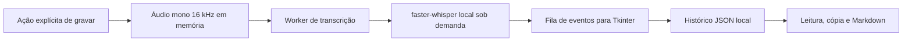

# Audio to Text

Aplicativo desktop Python/Tkinter para notas de voz em português brasileiro, com transcrição local usando faster-whisper. Esta versão de portfólio acrescenta histórico persistente, exportação Markdown e demonstração com dados fictícios.

## Recursos

- Interface em português com histórico selecionável e área de leitura.
- Estados explícitos de gravação, carregamento do modelo, transcrição e erro.
- Histórico JSON local, exclusão confirmada e exportação Markdown da nota selecionada.
- Cópia da nota selecionada para a área de transferência.
- Modelo `base` em CPU/int8, carregado na primeira transcrição e reutilizado na sessão.
- Modo `--demo` sem acesso ao microfone nem download/carregamento de modelo.

## Instalação local

Requer Python 3.11+ **com Tkinter funcional**. Tkinter depende da instalação do Python e não é fornecido pelo requirements.txt. O Python Homebrew disponível nesta sessão não possui a extensão `_tkinter`; use um interpretador com Tk e recrie o ambiente com ele antes de abrir a interface.

No diretório deste checkout:

```bash
rtk proxy python3 -m venv .venv
rtk proxy .venv/bin/python -m pip install -r requirements.txt
rtk proxy .venv/bin/python -m pip check
```

O ambiente .venv não é versionado. A demo dispensa as dependências de áudio, mas Tkinter é necessário nos dois modos. A primeira transcrição real pode baixar o modelo e exigir conexão; execuções posteriores reutilizam o cache local.

## Demonstração sem áudio real

```bash
rtk proxy .venv/bin/python transcriber_app.py --demo
```

Use a demo para apresentar notas fictícias, simular o fluxo, copiar, apagar e exportar. Ela usa armazenamento separado do histórico real. Não use conversas reais ou gravações em imagens/GIF de portfólio.

## Gravação e transcrição

```bash
rtk proxy .venv/bin/python transcriber_app.py
```

1. Inicie a gravação somente quando quiser participar da captura. O aplicativo não grava ao abrir.
2. Fale em português brasileiro e clique para parar e transcrever.
3. Aguarde o carregamento do modelo na primeira utilização e a transcrição em segundo plano.
4. Selecione uma nota para copiar, exportar ou apagar. Falhas aparecem na interface e preservam notas anteriores.

No macOS, a primeira gravação pode solicitar permissão de microfone para o Python ou terminal que iniciou o aplicativo. Caso necessário, revise **Ajustes do Sistema > Privacidade e Segurança > Microfone** e reinicie após mudar a permissão.

## Histórico e privacidade

No macOS, as notas ficam em:

- `~/Library/Application Support/Audio to Text/history.json`
- `~/Library/Application Support/Audio to Text/demo-history.json` (somente demo)

Nos demais sistemas, o diretório é `~/.local/share/audio-to-text`. A persistência usa substituição atômica. Se o JSON estiver corrompido, o arquivo é preservado e a escrita é bloqueada; faça uma cópia de segurança e recupere ou renomeie o arquivo antes de reiniciar. A interface informa falhas de armazenamento.

O áudio fica em memória e não é salvo em arquivo pelo aplicativo. **O texto das notas é persistido em disco sem criptografia.** Exportar cria Markdown no destino escolhido; copiar coloca texto na área de transferência do sistema. Apagar uma nota não remove exportações, backups ou conteúdo copiado.

A transcrição é local após o modelo estar disponível. O download inicial exige rede; não se presume que o cache do provedor ou a área de transferência sejam livres de acesso à rede.

## Arquitetura


```mermaid
flowchart LR
    A[Ação explícita de gravar] --> B[Áudio mono 16 kHz em memória]
    B --> C[Worker de transcrição]
    C --> D[faster-whisper local sob demanda]
    D --> E[Fila de eventos para Tkinter]
    E --> F[Histórico JSON local]
    F --> G[Leitura, cópia e Markdown]
```

O worker comunica progresso e resultados por uma fila, consumida no loop principal do Tkinter. A gravação usa sounddevice e amostras float32. A transcrição mantém `language="pt"`, `beam_size=5`, `temperature=0.0`, VAD e instrução para preservar termos técnicos em inglês. Não há diarização nem timestamps de palavras.

## Limites e continuidade

Importação de áudio, atalho global, instalador e GIF estão planejados em [docs/PORTFOLIO-PLAN.md](docs/PORTFOLIO-PLAN.md), fora desta fatia. Gravações longas consomem memória e o modelo CPU pode demorar. O aplicativo ainda requer validação manual no macOS com Tkinter e dispositivo disponíveis. Instâncias simultâneas compartilham o mesmo arquivo de histórico; evite abrir mais de uma instância do mesmo modo.

Não foram criados nem executados testes nesta tarefa. A revisão estática, compilação de sintaxe e checagem de dependências não comprovam aparência, permissões, qualidade da transcrição ou diálogos nativos. Resultados e roteiro manual estão em [docs/VALIDATION.md](docs/VALIDATION.md).

## Licença

Não há LICENSE no repositório nem declaração de licença de código aberto. Distribuição e instalador dependem de uma decisão de licença antes de publicação.
