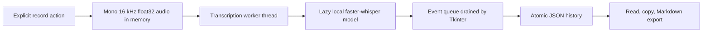

# Audio to Text

[](https://github.com/xfelipealves/audio-to-text/actions/workflows/tests.yml)

A local-first Python/Tkinter desktop app for Brazilian Portuguese voice notes. It records from the microphone only when you ask, transcribes on your machine with [faster-whisper](https://github.com/SYSTRAN/faster-whisper), and keeps a persistent history you can copy, export to Markdown, or delete. A `--demo` mode shows the whole flow with fictional data and never touches the microphone or the model.

The interface text is intentionally in Brazilian Portuguese, the language the app transcribes. Code, comments, and documentation are in English.

## Features

- Desktop window with a selectable history sidebar and a reading pane.
- Explicit states: ready, recording (with timer), loading model, transcribing, and error.
- Background worker thread that talks to the UI only through a `queue.Queue` drained on the Tk main loop.
- Lazy model loading: `faster-whisper` is imported and the `base` model (CPU, int8) is created on the first real transcription, then reused for the session.
- Persistent JSON history with atomic writes; corrupt or externally edited files are preserved, never overwritten.
- Copy the selected note, export it to Markdown (atomic write), or delete it after confirmation.
- `--demo` mode with fictional notes and a separate history file; no microphone, audio libraries, or model.

## Requirements

- macOS (primary target). Linux should work but is untested.
- Python 3.11+ **with a working Tkinter**. Tkinter ships with the interpreter, not with `pip`. Check it with:

  ```bash
  python3 -m tkinter
  ```

  A small Tk window should open. Homebrew's `python@3.14` currently lacks the `_tkinter` extension; the [python.org installer](https://www.python.org/downloads/macos/) or a `uv`-managed Python includes Tk.
- For real recordings: a microphone, macOS microphone permission for the launching app, and network access for the first model download.

## Installation

```bash
git clone git@github.com:xfelipealves/audio-to-text.git
cd audio-to-text
python3 -m venv .venv            # use a Python that passes `python3 -m tkinter`
.venv/bin/python -m pip install -r requirements.txt
.venv/bin/python -m pip check
```

`.venv`, bytecode, and downloaded models are not tracked. The demo needs only Tkinter; the audio dependencies are required for real recordings.

## Demo without real audio

```bash
.venv/bin/python transcriber_app.py --demo
```

Click **Simular gravação**, then **Concluir simulação** to generate a fictional note. Copy, export, and delete work as in the real mode. Demo notes are stored in a separate file. Use only demo mode for screenshots or recordings meant for a portfolio.

## Recording and transcription

```bash
.venv/bin/python transcriber_app.py
```

1. Click **Iniciar gravação** when you are ready. The app never records on launch.
2. Speak in Brazilian Portuguese; English technical terms are preserved when possible.
3. Click **Parar e transcrever**. The first run loads (and may download) the model; later runs reuse it.
4. Select a note in the history to copy, export, or delete. Errors are shown in the window and never erase existing notes.

On macOS the first recording may trigger a microphone permission prompt for Python or the terminal. If access was denied, enable it in **System Settings > Privacy & Security > Microphone** and restart the app.

## History and privacy

History files:

| Platform | Real notes | Demo notes |
| --- | --- | --- |
| macOS | `~/Library/Application Support/Audio to Text/history.json` | `.../demo-history.json` |
| Other | `~/.local/share/audio-to-text/history.json` | `.../demo-history.json` |

Writes go to a temporary file in the same directory, are `fsync`ed, and then replace the original with `os.replace`. If the file is corrupt, has an unknown version, mixes demo and real notes, or was changed by another process, the app preserves it, blocks further writes, and keeps new notes for the current session only (marked *não salvo*) so you can copy or export them. Back up the file and fix or rename it before restarting.

Audio stays in memory and is never written to disk by the app. **Note text is stored on disk unencrypted.** Exporting writes Markdown where you choose; copying uses the system clipboard. Deleting a note does not remove exports, backups, or clipboard contents. Transcription is local once the model is cached; the first download needs network access, and no claim is made that the model host or clipboard is network-free.

## Architecture


```mermaid
flowchart LR
    A[Explicit record action] --> B[Mono 16 kHz float32 audio in memory]
    B --> C[Transcription worker thread]
    C --> D[Lazy local faster-whisper model]
    D --> E[Event queue drained by Tkinter]
    E --> F[Atomic JSON history]
    F --> G[Read, copy, Markdown export]
```

| File | Responsibility |
| --- | --- |
| `transcriber_app.py` | Tkinter UI, state machine, `MicrophoneRecorder` (imports `sounddevice`/`numpy` only on first real recording), worker thread, `--demo` flag |
| `transcription_history.py` | Record schema, validation, atomic history store, Markdown export |
| `tests/` | Standard-library `unittest` suite |

Transcription uses `language="pt"`, `beam_size=5`, `temperature=0.0`, `condition_on_previous_text=False`, `vad_filter=True`, and an initial prompt asking to keep English technical terms. To trade speed for accuracy, change `"base"` in `_get_model()` to `"small"`, `"medium"`, or another supported model. There is no diarization and no word timestamps.

## Tests

```bash
python3 -m py_compile transcriber_app.py transcription_history.py tests/*.py
python3 -m unittest discover -v
```

The suite uses only the standard library and temporary directories: 23 history tests (round trip, atomic write failures, corrupt and mixed data, external edits, Markdown export) and 3 demo isolation tests that block `sounddevice`, `numpy`, `faster_whisper`, and `ctranslate2` imports and assert demo notes never reach the real history. The demo tests are skipped when the interpreter has no Tk. No test uses the microphone or downloads a model.

CI ([`.github/workflows/tests.yml`](.github/workflows/tests.yml)) runs the same two commands on Ubuntu with Python 3.12 under `xvfb-run`. It installs only `xvfb`, never the audio or model packages, and checks that `tkinter.Tk()` opens before the tests run, so the demo tests cannot be skipped silently there.

## Troubleshooting

- **`No module named '_tkinter'`**: recreate `.venv` with a Python that includes Tk (see Requirements).
- **Microphone errors**: check permissions and the selected input device, then restart the app.
- **Slow first transcription**: the model is downloading and loading; later transcriptions reuse it.
- **No speech detected**: record closer to the microphone or for longer.
- **English terms changed**: add vocabulary to `initial_prompt` in `transcriber_app.py`.
- **"Histórico indisponível"**: the history file is invalid or was edited elsewhere; it is preserved untouched. Copy or export new notes, close the app, and repair or rename the file.

## Limitations

- Real recording, model download, transcription quality, native dialogs, and macOS permissions have not been verified automatically; see [docs/VALIDATION.md](docs/VALIDATION.md).
- Microphone input only; no audio file import yet.
- Long recordings are held in memory; CPU inference can be slow.
- Running two instances of the same mode against one history file is not coordinated; the second writer is blocked rather than overwriting.
- No installer or packaged release.

Planned next steps are in [docs/PORTFOLIO-PLAN.md](docs/PORTFOLIO-PLAN.md).

## Contributing

Open an issue or a focused pull request. Keep the app local-first, update this README when setup or behavior changes, and run the test suite before submitting.

## License

There is no `LICENSE` file and no open-source license is claimed. Obtain permission before redistributing or reusing the code.
